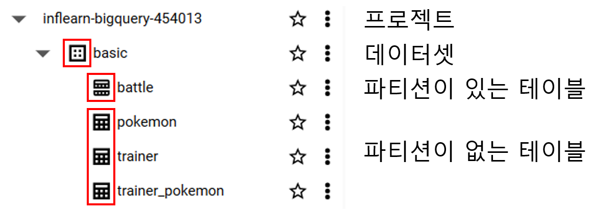
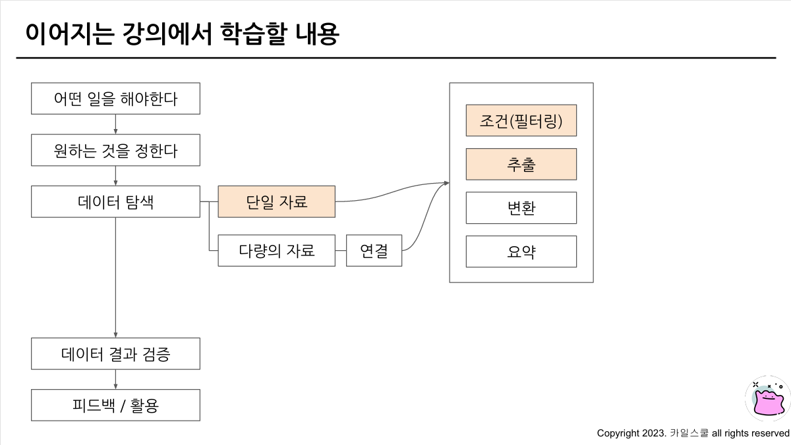
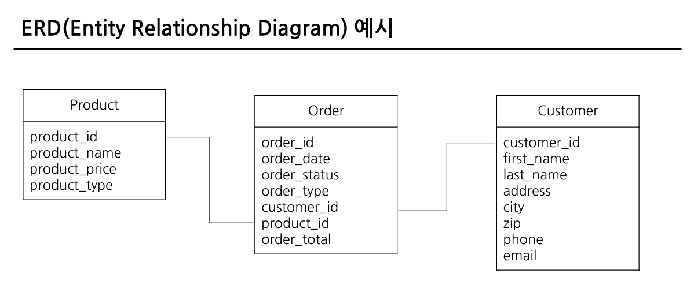
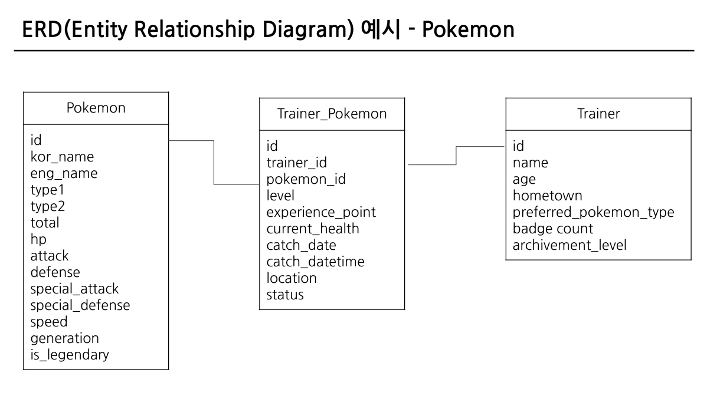
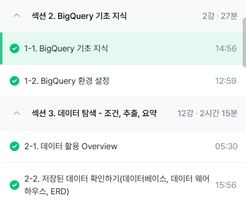

# SQL_BASIC 1주차 정규 과제 

📌SQL_BASIC 정규과제는 매주 정해진 분량의 `초보자를 위한 BigQuery(SQL) 입문` 강의를 듣고 간단한 문제를 풀면서 학습하는 것입니다. 이번주는 아래의 **SQL_Basic_1st_TIL**에 나열된 분량을 수강하고 `학습 목표`에 맞게 공부하시면 됩니다.

**1주차 과제**에서는 수강한 내용을 모두 요약 정리하기보다는, **SQL이 왜 필요한지에 대해 배우고 느낀 점, 그리고 강의를 듣고 본인이 원하는 목표를 중심으로 작성**하여 과제 업로드 시트에 깃허브 링크를 스프레드시트 'SQL' 시트에 붙여서 넣어주세요. 

**👀(수행 인증샷은 필수입니다.)** 

## SQL_BASIC_1st_TIL

### 섹션 2. BigQuery 기초 지식

### 1-1. BigQuery 기초 지식

### 1-2. BigQuery 환경 설정

## 섹션 3. 데이터 탐색 - 조건, 추출, 요약

### 2-1. 데이터 활용 Overview 

### 2-2. 저장된 데이터 확인하기

## 🏁 강의 수강 (Study Schedule)

| 주차  | 공부 범위              | 완료 여부 |
| ----- | ---------------------- | --------- |
| 1주차 | 섹션 **1-1** ~ **2-2** | ✅         |
| 2주차 | 섹션 **2-3** ~ **2-5** | 🍽️         |
| 3주차 | 섹션 **2-6** ~ **3-3** | 🍽️         |
| 4주차 | 섹션 **3-4** ~ **4-4** | 🍽️         |
| 5주차 | 섹션 **4-4** ~ **4-9** | 🍽️         |
| 6주차 | 섹션 **5-1** ~ **5-7** | 🍽️         |
| 7주차 | 섹션 **6-1** ~ **6-6** | 🍽️         |

 

<!-- 여기까진 그대로 둬 주세요-->

---

# 1️⃣ 개념정리 
<!-- 강의 수강 이후에 아래의 학습 목표에 맞게 개념을 자유롭게 정리해주세요.-->
## 1-1. BigQuery 기본지식

~~~
✅ 학습 목표 :
* 데이터 관련 기초 지식(OLTP, SQL, Row, Column, 저장 형태 등)을 설명할 수 있다. 
* BigQuery 관련 기초 지식에 대해서 파악할 수 있다. 
~~~

<!-- 새롭게 배운 내용을 자유롭게 정리해주세요.-->

- **데이터는 보통 데이터베이스 테이블 등에 저장** 
&nbsp;- Database(DB): 데이터의 저장소 
&nbsp;- Table: 데이터가 저장된 공간(데이터베이스 안에 Table이 존재함), 추출할 때 SQL 사용 
&nbsp;- 저장된 데이터를 제품(앱, 웹)에서 사용함

- 데이터의 저장 장소: MySQL, Oracle 등(회사 by 회사)

- OLTP(Online Transaction Processing) - 왜 BigQuery가 등장했는가? 
&nbsp;- 거래를 하기 위해 사용되는 데이터베이스 
&nbsp;- 중간(보류)가 없는 무결 상태. 
&nbsp;- 데이터의 추가(INSERT), 데이터의 변경(UPDATE)이 많이 발생 
&nbsp;- SQL을 사용해 데이터를 추출할 수 있으나, 분석을 위해 만든 데이터베이스가 아니라서 쿼리 속도가 느림.

- **SQL(Structured Query Language)**: 데이터베이스에서 데이터를 가지고 올 때 사용하는 언어 
&nbsp;ex) 쿼리문, 쿼리 구문, 쿼리를 짠다, SQL 쿼리 등으로 표현

- OLAP의 등장 
&nbsp;- OLTP가 느려서 OLAP가 등장함 
&nbsp;- OLAP(Online Analytical Processing): 분석을 위한 기능 제공 
&nbsp;- 데이터 웨어하우스: 데이터를 한 곳에 모아서 저장하는 곳 
&nbsp; ex) **구글 클라우드의 OLAP겸 데이터 웨어하우스가 BigQuery** 

- OLAP의 장점 
&nbsp;- SQL을 사용해 쉽게 추출 가능 
&nbsp; - 데이터 웨어하우스를 관리하기 위해 서버를 띄울 필요 없음(구글에서 인프라를 관리함)

- BigQuery를 사용하는 이유  - 회사에서 앱이나 웹에서 Firebase, Google Analytics 4를 활용할 경우  - 운영을 적은 비용(인력)으로 진행하기 위해

## 1-2. BigQuery 환경 설정
- **BigQuery의 환경 구성 요소** 
&nbsp;1) **프로젝트**: 하나의 큰 건물(하나의 프로젝트에 여러 데이터셋이 존재할 수 있음)  
&nbsp;2) **데이터셋**: 프로젝트에 있는 창고(각 창고 공간에 데이터를 저장, 하나의 데이터셋에 다양한 테이블이 존재할 수 있음) 
&ensp;ex) 판매 데이터, 고객 데이터 등 별도의 데이터 
&nbsp;3) **테이블**: 창고에 있는 선반(행과 열로 이루어진 데이터들이 저장됨)

- 생성된 테이블 확인 

## 2-1. 데이터 활용 Overview

~~~
✅ 학습 목표 :
* 데이터를 활용하는 과정을 설명할 수 있다.
* 데이터를 탐색하는 과정으로 조건과 추출, 요약을 할 수 있다. 
~~~

- 데이터를 활용하는 과정 
&nbsp;어떤 일을 해야 한다 &nbsp;-> 원하는 것을 정한다 &nbsp;-> 데이터 탐색 
&nbsp;-> 데이터에 대해 조건(필터링), 추출, 변환, 요약 &nbsp;-> 데이터 결과 검증 
&nbsp;-> 피드백/활용 
&nbsp;해당 과정에서 **데이터 탐색, 데이터 결과 검증 시 SQL을 활용**

- 2-2에서는 단일자료 가정, 조건(필터링)/추출을 어떻게 하는지 배울 예정 

<!-- 새롭게 배운 내용을 자유롭게 정리해주세요.-->

## 2-2. 저장된 데이터 활용하기

~~~
✅ 학습 목표 :
* 데이터가 저장되는 형태를 알고 저장된 데이터를 활용할 수 있다. 
~~~

 - **SQL 쿼리를 작성하기 전에** 
 &nbsp;- 데이터가 어떻게 저장되어 있는가를 생각해보기 
 &nbsp;- 어떤 데이터가 저장되어 있는가? 
 &nbsp;- 칼럼의 의미는 무엇인가? 
&nbsp;why? **데이터를 제대로 이해**해야 올바른 데이터를 추출할 수 있음 
&nbsp;- 예시: 데이터를 추출하기 전에 데이터 웨어하우스에 데이터가 어떻게 저장되어 있는지 확인

- **ERD(Entity Relationship Diagram)**: 데이터베이스의 구조를 한 눈에 알아보기 위해 사용 
&nbsp;- 예시  
&nbsp;- ERD가 없다면 모든 데이터베이스를 직접 보면서 탐색하면 되는 것이므로, **ERD가 필수적으로 있어야 하는 요소는 아님.**

- 포켓몬 세상을 데이터로 생각해보기 
어떤 데이터가 존재할까? 
&ensp;- 포켓몬 **(상품)** 
&ensp;- 트레이너 **(유저)** 
&ensp;- 트레이너가 잡은 포켓몬 **(주문)** 
&ensp;- 트레이너가 도전한 유저 배틀 
&ensp;- 트레이너가 도전한 체육관 배틀 
&ensp;- NPC 
&ensp;- 상점 
&ensp;- 상점 별로 판매하는 제품 
ERD 예시- pokemon 

<!-- 새롭게 배운 내용을 자유롭게 정리해주세요.-->

---
# 2️⃣ 학습 인증란

 
 

---

# 3️⃣ 확인문제

## 문제 1

> **🧚Q. 포켓몬 게임이나 이커머스 산업과 같이 다양한 산업에서는 각기 다른 데이터가 존재합니다. 다음 중 하나의 산업을 선택하고, 해당 산업에서 수집하고 활용될 수 있는 데이터 항목 (칼럼) 5가지를 자유롭게 상상하여 나열해보세요.**
>
> - 예시 산업 
>
> >  온라인 음식 배달 / 스마트 헬스 케어 / 중고 거래 앱 / 교육 플랫폼 등 

<!--현실과 데이터 분석의 연결 고리를 상상하고, 데이터를 저장하는 형태를 활용하는 문제입니다. -->

<!--학습한 개념을 활용하여 자유롭게 설명해 보세요. 구체적인 예시를 들어 설명하면 더욱 좋습니다.-->

~~~
온라인 음식 배달
주문번호, 음식명, 주문시간, 결제금액, 배달 소요시간
~~~

## 문제 2

> **🧚Q. 이번 강의를 통해 SQL이 왜 필요하다고 느끼는지, SQL을 통해 본인이 어떤 것을 해내고 싶은지를 자유롭게 작성해보세요.**

~~~
<필요성>
SQL은 데이터베이스에서 데이터를 가지고 올 때 사용하는 언어로써 데이터 탐색, 데이터 결과 검증 시 활용 가능한 도구이다. 
~~~
~~~
<느낀점>
SQL은 ADsP를 공부하면서 살짝 들어만 봤던 개념인데, 강의 내용에 따르면 기업에서 많이 활용하는 것 같다 SQL도 활용 가능한 수준까지 공부해 둔다면 데이터 분석 역량이 넓어질 수 있을 것이다.
~~~

### 🎉 수고하셨습니다.