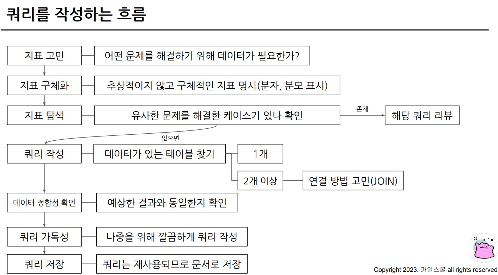
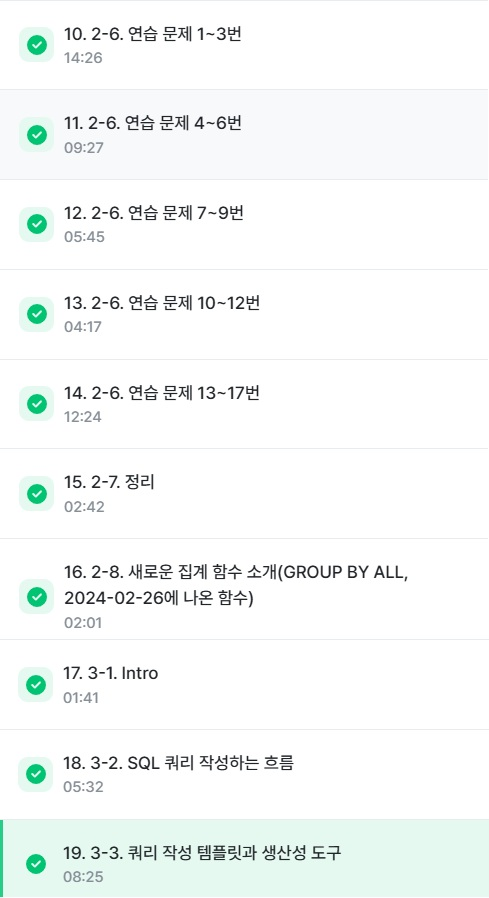

# SQL_BASIC 3주차 정규 과제 

📌SQL_BASIC 정규과제는 매주 정해진 분량의 `초보자를 위한 BigQuery(SQL) 입문` 강의를 듣고 간단한 문제를 풀면서 학습하는 것입니다. 이번주는 아래의 **SQL_Basic_3rd_TIL**에 나열된 분량을 수강하고 `학습 목표`에 맞게 공부하시면 됩니다.

**3주차 과제는 문제 풀이를 중심으로**, 강의에서 제시된 예제 문제 중 **7 문제 이상을 선택하여 직접 풀어본 뒤**, 강의 영상의 풀이와 비교해 **틀린 부분, 맞은 부분, 새롭게 배운 개념**을 구체적으로 정리해주세요. (적어도 3문제는 정리해야 합니다.) 완성된 과제는 Gihub에 업로드하고, 링크를 스프레드시트 'SQL' 시트에 입력해 제출해주세요.

**(수행 인증샷은 필수입니다.)** 

## SQL_BASIC_3rd

### 섹션 3. 데이터 탐색 - 조건, 추출, 요약

### 2-6. 연습문제 1~3번

### 2-6. 연습문제 7~9번

### 2-6. 연습문제 10~12번

### 2-6. 연습문제 13~17번

### 2-7. 정리 

### 2-8. 새로운 집계함수


## 섹션 4. 쿼리 잘 작성하기, 쿼리 작성 템플릿 및 오류를 잘 디버깅하기

### 3-1. INTRO

### 3-2. SQL 쿼리 작성하는 흐름

### 3-3. 쿼리 작성 템플릿과 생산성 도구 


## 🏁 강의 수강 (Study Schedule)

| 주차  | 공부 범위              | 완료 여부 |
| ----- | ---------------------- | --------- |
| 1주차 | 섹션 **1-1** ~ **2-2** | ✅         |
| 2주차 | 섹션 **2-3** ~ **2-5** | ✅         |
| 3주차 | 섹션 **2-6** ~ **3-3** | ✅         |
| 4주차 | 섹션 **3-4** ~ **4-4** | 🍽️         |
| 5주차 | 섹션 **4-4** ~ **4-9** | 🍽️         |
| 6주차 | 섹션 **5-1** ~ **5-7** | 🍽️         |
| 7주차 | 섹션 **6-1** ~ **6-6** | 🍽️         |

<br>

<!-- 여기까진 그대로 둬 주세요-->

---

# 1️⃣ 개념정리

## 2-6. 연습문제

~~~
✅ 학습 목표 :
* 연습문제(7문제 이상) 푼 것들 정리하기
~~~
>**1번**
<br> - (힌트) ~가 없다: 컬럼 IS NULL
<br> - NULL: 아무것도 없는 값. 값이 존재하지 않을 때 NULL(NULL은 0 혹은 "&nbsp;"과도 다름. 값이 없는 상태)
<br> - NULL의 연산: 다른 값과 직접 비교할 수 없음. 따라서, IS 연산자를 사용함.
<br> - WHERE절에서 여러 조건을 연결하고 싶은 경우 -> AND 조건을 사용
<br> - OR 조건: (&ensp;) OR (&ensp;) 

>**2번**
<br> - 포켓몬 수를 집계해야 하므로 'COUNT'
<br> - 정렬 -> ORDER BY, 내림차순 ->DESC => ORDER BY 포켓몬 수 DESC
<br> - 빨간 밑줄: 에러 메시지(읽어보면서 해결 가능)
<br> - 집계 함수는 GROUP BY와 같이 다님. 집계하는 기준(컬럼)이 없으면 COUNT만 쓸 수 있으나, 집계하는 기준이 있다면 그 기준 컬럼을 GROUP BY에 써줘야 한다

>**3번**
<br> - '상관없이' 조건인가 아닌가?: 조건이 아님
<br> - 집계: 포켓몬 수 -> COUNT
<br> - DISTINCT: 고유한 값만 보고 싶을 때 사용한다.(다만, 여기서는 id를 설계할 때, 중복이 없게 설계했음. 그래서 DISTINCT의 유무에 상관없이 결과가 동일.)

>**4번**
<br> - 조건: 없음
<br> - 전설(is_legendary)
<br> - 컬럼의 이름 앞부분 일부를 입력하고 기다리면 자동 완성을 할 수 있는데, 이 때 찾아서 엔터하면 됨.
<br> - GROUP BY: 1, 2를 통해 직접 해당 컬럼의 입력하지 않고 순서를 언급함으로써 대체 가능(ORDER BY에도 적용 가능)

>**5번**
<br> - 조건: 같은 이름이 2개 이상(동명이인) => COUNT(name) => 2개 이상
<br> - 집계: COUNT
<br> - 집계 후 조건: HAVING, FROM절의 테이블 조건: WHERE
<br>&ensp; - WHERE: 원본 데이터 FROM절에 있는 데이터에 조건을 설정하고 싶은 경우
<br>&ensp; - HAVING: GROUP BY와 함께 집계 걸과에 조건을 설정하고 싶은 경우우

>**6번**
<br> - 조건: 트레이너의 이름 = "IRIS"
<br> - 컬럼: 정보 => 모든 컬럼
<br> - 집계: X

>**7번**
<br> - 조건: 이름 = "IRIS", "Whitney", "Cynthia" 중에 있으면 추출
<br> - 컬럼: 정보 -> *
<br> - 집계: 없음
<br> - OR을 쓰면 동명이인을 찾아낼 수 있음.
<br> - 힌트: OR조건으로 써서 코드가 길어져서 귀찮다면 => IN
<br> - IN: name에 괄호 안의 Value가 있는 Row만 추출
<!-- 새롭게 배운 내용을 자유롭게 정리해주세요.-->


## 2-8. 새로운 집계함수

~~~
✅ 학습 목표 :
* SQL 쿼리 구조를 이해할 수 있다. 
* SELECT, FROM, WHERE을 활용하는 방법을 설명할 수 있다. 
~~~

### 📌 `GROUP BY ALL` 이란?

* **SQL 표준에 없는 문법**이고, **SQL Server (MSSQL) 등 일부 DBMS**에서만 지원됩니다.
* 일반적인 `GROUP BY`는 `WHERE`에서 조건으로 제외된 행은 집계 대상에 포함되지 않지만,
  `GROUP BY ALL`은 `WHERE` 절에 의해 제외된 그룹도 결과에 포함시킵니다.
* 즉, **모든 그룹(type, category 등)을 결과에 표시**하되, 조건에 맞는 값만 집계하고 조건에 맞지 않는 그룹은 집계값이 `NULL` 또는 `0`으로 나옵니다.

---

### 📌 사용 예시

예를 들어 `pokemon` 테이블이 있고, 전기 타입만 보고 싶다고 할 때:

```sql
-- 일반 GROUP BY
SELECT type1, COUNT(*) AS cnt
FROM pokemon
WHERE type1 = 'Electric'
GROUP BY type1;
```

➡️ 결과: Electric 타입만 출력됨.

```sql
-- GROUP BY ALL
SELECT type1, COUNT(*) AS cnt
FROM pokemon
WHERE type1 = 'Electric'
GROUP BY ALL type1;
```

➡️ 결과: **모든 type1이 출력**되지만, Electric 외의 타입은 `cnt=0` 또는 NULL로 표시.

---

### 📌 주의할 점

* **표준 SQL 아님** → 이식성 떨어짐.
* MySQL, PostgreSQL, Oracle에서는 지원하지 않음.
* SQL Server에서도 최신 버전에서는 `GROUP BY ALL`이 **deprecated(더 이상 권장되지 않음)** 상태입니다. 대신 **`GROUP BY` + `LEFT JOIN`** 같은 방식을 활용하는 것이 표준적이다.


<!-- 새롭게 배운 내용을 자유롭게 정리해주세요.-->


## 3-2. 쿼리를 작성하는 흐름

~~~
✅ 학습 목표 :
* 쿼리를 작성하는 흐름을 설명할 수 있다.
~~~



<!-- 새롭게 배운 내용을 자유롭게 정리해주세요.-->


## 3-3. 쿼리 작성 템플릿과 생산성 도구

~~~
✅ 학습 목표 :
* 생산성 도구를 만들 수 있다.
~~~
### 3-3-1. 쿼리 작성 템플릿

```
# 쿼리를 작성하는 목표, 확인할 지표:
# 쿼리 계산 방법:
# 데이터의 기간:
# 사용할 테이블:
# Join KEY:
# 데이터 특징:
```
```
SELECT

FROM
WHERE
```

### 3-3-2. 템플릿과 생산성 도구
- 템플릿을 잘 사용할 수 있을까?
  1. 템플릿을 사용하자! 라고 제시
  1. 템플릿을 사용하는 것을 까먹음
  1. 습관 형성이 되지 않음
  1. 이 부분을 개선하고자 **생산성 도구**를 활용

- 생산성 도구: Espanso
  - 특정 단어가 감지되면 정의된 것으로 바꾼다!


<!-- 이어질 주차에서 생산성 도구를 활용한 실습이 있습니다.강의에 맞게 제작하여 화면을 캡쳐하여 이 주석을 지우고 올려주세요. -->


<br>
<br>

---

# 2️⃣ 학습 인증란

<!-- 이 글을 지우고, 여기에 학습한 것을 인증해주세요.-->



<br><br>


---

# 3️⃣ 확인문제

## 문제 1

> **🧚Q. 포켓몬 게임에 재미를 느낀 동혁은 포켓몬 도감에서 강력한 포켓몬 타입을 미리 선점하기 위해, 먼저 어떤 포켓몬들이 있는지 포켓몬 수를 기준으로 내림차순 정렬하여  확인하고자 했습니다.**
>
> 그래서 다음과 같은 필요한 정보를 미리 정리해보았습니다. 

~~~
조건 : type2는 상관없이
보고 싶은 컬럼 : type1
집계 내용 : 각 type1 별 포켓몬 수
정렬 기준 : 포켓몬 수를 기준으로 내림차순 정렬
~~~

> **이 목표를 바탕으로 동혁이 아래와 같은 쿼리를 잘 작성했지만, 일부 SQL 문법 요소를 빼먹었습니다. 비어 있는 부분인 ㄱ,ㄴ,ㄷ 에 들어갈 알맞은 SQL 구문을 채워보세요:**

~~~sql
SELECT type1, (ㄱ)
FROM pokemon
(ㄴ) type1
ORDER BY (ㄱ) (ㄷ);
~~~

|항목|답|근거|
|---|---|---|
|(ㄱ)|COUNT(*)|type 1 포켓몬 수 집계|
|(ㄴ)|GROUP BY| 집계 기준 정하기|
|(ㄷ)|DESC|정렬 방향 지정|

~~~sql
SELECT type1, COUNT(*) AS cnt
FROM pokemon
GROUP BY type1
ORDER BY COUNT(*) DESC;
~~~

### 🎉 수고하셨습니다.