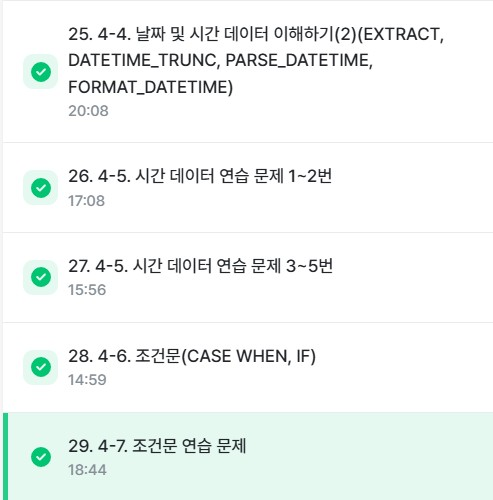

# SQL_BASIC 5주차 정규 과제 

📌SQL_BASIC 정규과제는 매주 정해진 분량의 `초보자를 위한 BigQuery(SQL) 입문` 강의를 듣고 간단한 문제를 풀면서 학습하는 것입니다. 이번주는 아래의 **SQL_Basic_5th_TIL**에 나열된 분량을 수강하고 `학습 목표`에 맞게 공부하시면 됩니다.

**5주차 과제는 문제 풀이를 중심으로**, 강의에서 제시된 예제 문제 중 **3 문제 이상을 선택하여 직접 풀어본 뒤**, 강의 영상의 풀이와 비교해 **틀린 부분, 맞은 부분, 새롭게 배운 개념**을 구체적으로 정리해주세요. (적어도 4문제는 정리해야 합니다.) 완성된 과제는 Gihub에 업로드하고, 링크를 스프레드시트 'SQL' 시트에 입력해 제출해주세요.

**(수행 인증샷은 필수입니다.)** 


## SQL_BASIC_5th

### 섹션 5. 데이터 탐색 - 변환

### 4-4. 날짜 및 시간 데이터 이해하기(2) (EXTRACT, DATETIME_TRUNC, PARSE_DATETIME, FROMAT_DATETIME)

### 4-5. 시간 데이터 연습문제 1~2번

### 4-5. 시간 데이터 연습문제 3~5번

### 4-6. 조건문 (CASE WHEN, IF)

### 4-7. 조건문 연습 문제

### 4-8. 정리

### 4-9. BigQuery 공식 문서 확인하는 법

(강의에서 연습문제가 많아서 따로 프로그래머스 문제 과제는 없습니다.)


## 🏁 강의 수강 (Study Schedule)

| 주차  | 공부 범위              | 완료 여부 |
| ----- | ---------------------- | --------- |
| 1주차 | 섹션 **1-1** ~ **2-2** | ✅         |
| 2주차 | 섹션 **2-3** ~ **2-5** | ✅         |
| 3주차 | 섹션 **2-6** ~ **3-3** | ✅         |
| 4주차 | 섹션 **3-4** ~ **4-4** | ✅         |
| 5주차 | 섹션 **4-4** ~ **4-9** | ✅         |
| 6주차 | 섹션 **5-1** ~ **5-7** | 🍽️         |
| 7주차 | 섹션 **6-1** ~ **6-6** | 🍽️         |

<br>


<!-- 여기까진 그대로 둬 주세요-->

---

# 4-4. 날짜 및 시간 데이터 이해하기(2) (EXTRACT, DATETIME_TRUNC, PARSE_DATETIME, FROMAT_DATETIME)

~~~
✅ 학습 목표 :
* 날짜 및 시간 데이터에 대해서 더 자세히 설명할 수 있다. 
* CURRENT_TIME, EXTRACT, DATETIME_TRUNC, PARSE_DATETIME, FROMAT_DATETIME 을 설명할 수 있다. 
~~~

- CURRENT_DATETIME
  - CURRENT_DATETIME([time_zone]): 현재 DATETIME 출력
  - 예시
```
SELECT
  CURRENT_DATE() AS current_date,
  CURRENT_DATE("Asia/Seoul") AS asia_date,
  CURRENT_DATETIME() AS current_datetime,
  CURRENT_DATETIME("Asia/Seoul") AS current_datetime_asia;
```

- EXTRACT
  - DATETIME에서 특정 부분만 추출하고 싶은 경우
  - 요일을 추출하고 싶은 경우
    - EXTRACT(DAYOFWEEK FROM datetime_col)
    <br>: 한 주의 첫날이 일요일인 [1,7] 범위의 값을 반환
```
SELECT
  EXTRACT(DATE FROM DATETIME "2024-01-02 14:00:00") AS date,
  EXTRACT(YEAR FROM DATETIME "2024-01-02 14:00:00") AS year
```

- DATETIME_TRUNC
  - DATE와 HOUR만 남기고 싶은 경우 -> 시간 자르기
  - DATETIME_TRUNC(datetime_col, HOUR)

- PARSE_DATETIME
  - 문자열로 저장된 DATETIME을 DATETIME 타입으로 바꾸고 싶은 경우
  - Format Elements 문서를 확인하면 %Y 등이 어떤 의미인지 알 수 없음
```
SELECT
  PARSE_DATETIME('%Y-%m-$d %H:%M:%S', 2024-01-11 12:35:35') AS parse_datetime;
```

- FORMAT_DATETIME
  - DATETIME 타입 데이터를 특정 형태의 문자열 데이터로 변환하고 싶은 경우
```
SELECT
 FORMAT_DATEITME("%c", DATETIME "2024-01-11 12:35:35") AS formatted;
```


<!-- 새롭게 배운 내용을 자유롭게 정리해주세요.-->


# 4-6. 조건문(CASE WHEN, IF)

~~~
✅ 학습 목표 :
* 조건문 함수의 기능을 이해하고, 설명할 수 있다. 
~~~

- 조건문
  - 만약 특정 조건이 충족되면, 어떤 행동을 하자
  - 특정 조건이 참일 때 A, 아니면 B
  - 조건에 따른 분기 처리가 필요한 경우, 혹은 조건에 따라 다른 값을 표시하고 싶을 때 사용
  - 사용하는 방법
    - CASE WHEN
    - IF

- 조건문 함수가 사용되는 이유
  - 분석 시 특정 카테고리를 하나로 합치는 전처리가 필요한 경우가 있음
  - 예시
    - 데이터를 저장하는 쪽과 분석하는 쪽이 나뉨
    - 분석할 때 필요한 부분에서 조건 설정해서 변경하는 것이 더 유용

```
<CASE WHEN: 여러 조건이 있을 경우 유용>
SELECT
  CASE
    WHEN 조건1 THEN 조건1이 참일 경우 결과
    WHEN 조건2 HTHEN 조건2가 참일 경우 결과
    ELSE 그 외 조건일 경우 결과
END AS 새로운_컬럼_이름
```

```
<IF: 단일 조건일 경우 유용>
SELECT
  IF(1=1, '동일한 결과', '동일하지 않은 결과') AS result1,
  IF(1=2, '동일한 결과', '동일하지 않은 결과') AS result2
```


<!-- 새롭게 배운 내용을 자유롭게 정리해주세요.-->


 # 4-5. 시간 데이터 연습문제 & 4-7. 조건문 연습 문제

~~~
✅ 학습 목표 :
* 4-5, 4-7 각각에서 두 문제 이상 (최소 4문제) 푼 내용 정리하기
~~~

## 4-5. 시간 데이터 연습 문제

1. 트레이너가 포켓몬을 포획한 날짜(catch_date)를 기준으로, 2023년 1월에 포획한 포켓몬의 수를 계산해주세요.
```
SELECT
  COUNT(DISTINCT id) AS cnt
FROM basic.trainer_pokemon
WHERE"
  EXTRACT(YEAR FROM DATETIME(catch_datetime, "Asia/Seoul")) = 2023
  AND EXTRACT(MONTH FROM DATETIME(catch_datetime, "Asia/Seoul")) = 1
```
```
답: 85
```

2. 배틀이 일어난 시간(battle_datetime)을 기준으로, 오전 6시에서 오후 6시 사이에 일어난 배틀의 수를 계산해주세요.

```
SELECT
  COUNT(DISTINCT id) AS battle_cnt
FROM basic.battle
WHERE
  EXTRACT(HOUR FROM battle_datetime) >= 6
  AND EXTRACT(HOUR FROM battle_datetime) <= 18
```
```
답: 44
```

## 4-7. 조건문 연습 문제

1. 포켓몬의 'speed'가 70 이상이면 '빠름', 그렇지 않으면 '느림'으로 표시하는 새로운 컬럼 'Speed_Category'를 만들어 주세요.

```
SELECT
  id,
  kor_name,
  speed,
  IF(speed >= 70, "빠름", "느림") AS Speed_Category
FROM basic.pokemon
```

2. 포켓몬의 'type 1'에 따라 'Water', 'Fire', 'Electric' 타입은 각각 '물', '불', '전기'로, 그 외 타입은 '기타'로 분류하는 새로운 컬럼 'type_Korean'을 만들어 주세요.

```
SELECT
  id,
  kor_name,
  type1,
  CASE
    WHEN type1 = "Water" THEN "물"
    WHEN type1 = "Fire" THEN "불"
    WHEN type1 = "Electric" THEN "전기"
    ELSE "기타"
  END AS type1_Korean
FROM basic.pokemon
```

<!-- 새롭게 배운 내용을 자유롭게 정리해주세요.-->


<br>

<br>

---

# 학습 인증란



<br><br>


---

# 확인문제

## 문제 1

> **🧚Q. 광윤이는 사용자 로그 데이터에서, 2021년에 접속한 사용자 수를  집계하려고 했습니다. 그는 여러 SQL 쿼리들을 실행해봤지만, 그 중 일부는 문법적으로 잘못되어 실행되지 않았습니다. 다음 보기 중 틀린 쿼리를 모두 골라보세요 (복수 선택 가능)**

~~~sql
1. SELECT COUNT(*)  
   FROM user_log  
   WHERE EXTRACT(YEAR FROM login_date) = 2021;

2. SELECT EXTRACT(YEAR FROM login_date), COUNT(*)  
   FROM user_log  
   GROUP BY EXTRACT(YEAR FROM login_date);

3. SELECT COUNT(*)  
   FROM user_log  
   WHERE login_date = '2021';

4. SELECT COUNT(*)  
   FROM user_log  
   WHERE login_date BETWEEN '2021-01-01' AND '2021-12-31';
~~~

<!-- 틀린쿼리에 대한 오류의 원인도 같이 작성해주세요. 문제에서 제공된 login_data 컬럼은 DATE type의 데이터를 가지고 있다고 가정하시면 됩니다. -->

~~~
답: 3번
이유: 연도 전체를 세려면 범위 조건이나 연도 추출이 필요함
~~~


## 문제 2

> **🧚Q. 혜성이는 포켓몬 타입에 따라 설명을 부여하는 쿼리를 작성했습니다. type 1 컬럼의 값에 따라 조건을 분기했으며, 다음 SQL 쿼리를 실행했습니다.**

~~~sql
SELECT name,
       CASE 
         WHEN type1 = 'Fire' THEN 'Hot'
         WHEN type1 = 'Water' THEN 'Cool'
         ELSE 'Normal'
       END AS type_description
FROM pokemon;
~~~

> **다음 중 type_description의 결과가 'Normal'로 출력될 포켓몬은?**

| **name**   | **type1** |
| ---------- | --------- |
| Pikachu    | Electric  |
| Charmander | Fire      |
| Squirtle   | Water     |
| Bulbasaur  | Grass     |

<!-- 근거와 함께 답을 작성해주세요 -->

~~~
답: Pikachu, Bulbasaur
이유: Pikachu와 Bulbasaur는 Fire, Water 모두에 해당하지 않으므로 Normal로 분류된다.
~~~


<br>

### 🎉 수고하셨습니다.