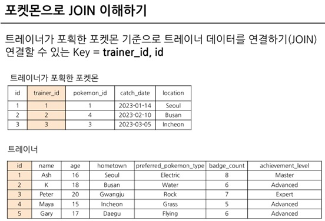
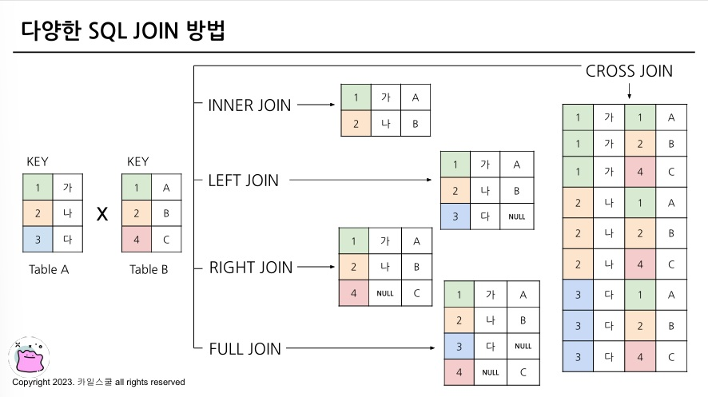
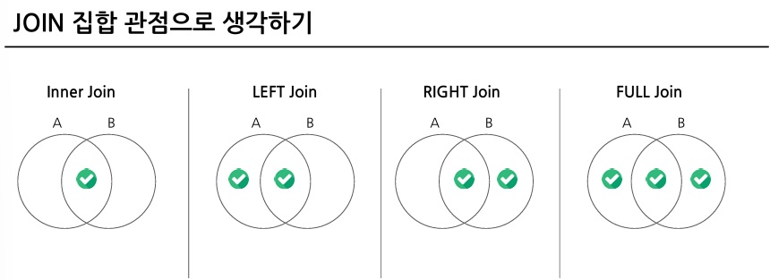

# SQL_BASIC 6주차 정규 과제 

📌SQL_BASIC 정규과제는 매주 정해진 분량의 `초보자를 위한 BigQuery(SQL) 입문` 강의를 듣고 간단한 문제를 풀면서 학습하는 것입니다. 이번주는 아래의 **SQL_Basic_6th_TIL**에 나열된 분량을 수강하고 `학습 목표`에 맞게 공부하시면 됩니다.

**6주차 과제는 강의 내용을 정리하는 것과 함께, 프로그래머스에서 제공하는 SQL 문제를 직접 풀어보는 실습도 병행합니다.** 강의에서는 **배운 내용을 정리하고 주요 쿼리 예제를 정리**하며, 프로그래머스 문제는 **직접 풀어본 뒤 풀이 과정과 결과, 배운 점을 함께 기록**해주세요. 완성된 과제는 Github에 업로드하고, 링크를 스프레드시트 'SQL' 시트에 입력해 제출해주세요.

**(수행 인증샷은 필수입니다.)** 

## SQL_BASIC_6th

### 섹션 6. 다량의 자료를 연결 : JOIN 

### 5-1. Intro

### 5-2. JOIN 이해하기

### 5-3. 다양한 JOIN 방법

### 5-4. JOIN 쿼리 작성하기 

### 5-5. JOIN을 처음 공부할 때 헷갈렸던 부분

### 5-6. JOIN 연습문제 1~2번

### 5-6. JOIN 연습문제 3~5번

### 5-7. 정리


## 🏁 강의 수강 (Study Schedule)

| 주차  | 공부 범위              | 완료 여부 |
| ----- | ---------------------- | --------- |
| 1주차 | 섹션 **1-1** ~ **2-2** | ✅         |
| 2주차 | 섹션 **2-3** ~ **2-5** | ✅         |
| 3주차 | 섹션 **2-6** ~ **3-3** | ✅         |
| 4주차 | 섹션 **3-4** ~ **4-4** | ✅         |
| 5주차 | 섹션 **4-4** ~ **4-9** | ✅         |
| 6주차 | 섹션 **5-1** ~ **5-7** | ✅         |
| 7주차 | 섹션 **6-1** ~ **6-6** | 🍽️         |

<!-- 여기까진 그대로 둬 주세요-->

<br>

---

# 1️⃣ 개념정리

## 5-2. JOIN 이해하기

~~~
✅ 학습 목표 :
* JOIN에 대한 정의와 필요성에 대해 설명할 수 있다.
~~~

- 정의
  - 간단 정의: 서로 다른 데이터 테이블을 연결하는 것
  - 공통적으로 존재하는 컬럼(=Key)이 있다면, JOIN 할 수 있음
    - 보통 id값을 Key로 많이 사용하고, 특정 범위(예: Date)로 JOIN도 가능함
  <br>

- JOIN의 필요성
  - 관계형 데이터베이스(RDBMS) 설계 시 정규화 과정을 거침
    - 정규화는 중복을 최소화하게 데이터를 구조화
    - 따라서 데이터를 다양한 Table에 저장해서 필요할 때 JOIN해서 사용(데이터에 중복이 없도록 쪼개놓은 후 필요할 때 JOIN해서 사용한다는 뜻)
  - JOIN을 바라보는 관점
    - 데이터 분석 관점: 미리 JOIN 되어 있는 것이 편함
    - 개발자 관점: 분리되어 있는 것이 좋음
  - 데이터 분석가: 데이터 웨어하우스에 쪼개져서 저장되어 있는 데이터를 JOIN 및 필요한 연산을 통해 데이터 마트를 만들어서 활용함.

<!-- 새롭게 배운 내용을 자유롭게 정리해주세요.-->


## 5-3. 다양한 JOIN 방법

~~~
✅ 학습 목표 :
* JOIN 방법들의 종류를 설명할 수 있다. 
* 각 JOIN 방법들의 차이점에 대해서 설명할 수 있다. 
~~~

- JOIN 방법들의 종류
  - INNER JOIN: 두 테이블의 **공통** 요소만 연결
  - LEFT/RIGHT (OUTER) JOIN: 왼쪽/오른쪽 테이블 기준으로 연결
  - FULL (OUTER) JOIN: **양쪽** 기준으로 연결
  - CROSS JOIN: 두 테이블의 각각의 **요소**를 **곱하기**

- JOIN 방법들의 차이점(그림)
<br><br>


<!-- 새롭게 배운 내용을 자유롭게 정리해주세요.-->


## 5-4. JOIN 쿼리 작성하기 

~~~
✅ 학습 목표 :
* JOIN을 사용한 문법에 대해 이해하여 적용할 수 있다.
* JOIN 을 활용한 쿼리를 작성할 수 있다. 
~~~

```
SELECT
  A.col1,
  A.col2,
  B.col11,
  B.col12
FROM table1 AS A
LEFT JOIN table2 AS B
ON A.key = B.key
```

- JOIN 문법
  - FROM 하단에 JOIN 할 Table을 작성하고 ON 뒤에 공통된 컬럼(Key)를 작성
  - LEFT JOIN 자리에 INNER, RIGHT, FULL, CROSS 가 들어가면 됨.
  - 테이블 이름이 길 수 있기 때문에 별칭(Alias)를 정의해줄 수 있음


<!-- 새롭게 배운 내용을 자유롭게 정리해주세요.-->


## 5-6. JOIN 연습문제 1~5번 

~~~
✅ 학습 목표 :
* 연습문제(3문제 이상) 푼 것들 정리하기
~~~

1. 트레이너가 보유한 포켓몬들은 얼마나 있는지 알 수 있는 쿼리를 작성해 주세요.

```
SELECT
  COUNT(*) AS cnt
FROM basic.trainer_pokemon
WHERE
  status IN ("Active", "Training")
```


2. 각 트레이너가 가진 포켓몬 중에서 'Grass'타입의 포켓몬 수를 계산해 주세요.(단, 편의를 위해 type1 기준으로 계산해주세요)

```
SELECT
  P.TYPE1,
  COUNT(tp.id) AS pokemon_Cnt
FROM (
  SELECT
    id,
    trainer_id,
    pokemon_id,
    status
  FROM basic.trainer_pokemon
  WHERE
    status IN ("Active", Training")
)  AS tp
LEFT JOIN basic.pokemon AS p
ON tp.pokemon_id = p.id
WHERE
  type 1 = "Grass"
GROUP BY
  type1
ORDER BY
  2 DESC
```

```
답: 23
```

3. 트레이너의 고향(hometown)과 포켓몬을 포획한 위치(location)를 비교하여, 자신의 고향에서 포켓몬을 포획한 트레이너의 수를 계산해주세요.(참고 status 상관없이 구해주세요.)

```
SELECT
  COUNT(DISTINCT tp.trainer_id) AS trainer_uniq,
  COUNT(tp.trianer_id) AS trainer_cnt,
FROM basic.trainer AS t
LEFT JOIN basic.trianer_pokemon AS tp
ON t.id = tp.trainer_id
WHERE
  tp.location IS NOT NULL
  AND t.hometonw = tp.location
```

```
답: 43
```

<!-- 새롭게 배운 내용을 자유롭게 정리해주세요.-->


<br>

<br>

---

# 2️⃣ 확인문제 & 문제 인증

## 프로그래머스 문제 

https://school.programmers.co.kr/learn/courses/30/lessons/164673

> 조건에 부합하는 중고거래 댓글 조회하기 (JOIN)

https://school.programmers.co.kr/learn/courses/30/lessons/144854

> 조건에 맞는 도서와 저자 리스트 출력하기 (JOIN)

<!-- 정답을 맞추게 되면, 정답입니다. 이 부분을 캡처해서 이 주석을 지우시고 첨부해주시면 됩니다. --> 


---

# 3️⃣ 참고자료

JOIN 에 대해서 그림으로 쉽게 이해할 수 있는 자료들도 있어서 첨부합니다. 아래의 블로그도 학습할 때 같이 참고해주세요.

1. https://data-marketing-bk.tistory.com/entry/SQL-JOIN-%ED%95%9C-%EB%B0%A9%EC%97%90-%EC%A0%95%EB%A6%AC-%EA%B0%9C%EB%85%90%EB%B6%80%ED%84%B0-%EC%BD%94%EB%93%9C%EA%B9%8C%EC%A7%80-%EC%9D%B4%EA%B2%83%EB%A7%8C-%EB%B3%B4%EC%9E%90


2. https://velog.io/@wijoonwu/JOIN

<br>

### 🎉 수고하셨습니다.